<!--more-->

## SSM框架Demo之EasyShop购物商城
### 功能 
购物商城该有的功能雏形：
1.用户：注册、登录、浏览商品、添加购物车、提交订单、支付、查看订单。
2.管理员：管理商品、管理用户。
### 难点分析
1.业务逻辑：经常网上购物，业务逻辑再清楚不过。
2.技术问题：我们站在巨人的肩膀上，只要思路清晰，技术问题均可解决。
3.支付功能：支付宝和微信支付接口均只提供给企业用户注册，但都提供了可用于模拟测试的沙箱环境。
4.界面设计：网上购物商城数不甚数，美观者也不在少数，可仿照借鉴。
5.数据库设计：系统最大难题，需根据业务逻辑设计和不断调整。
6.商品来源：爬虫获取。
### 系统用时
实现6天+总结0.5天
### 商城展示
#### 一.用户
1.注册
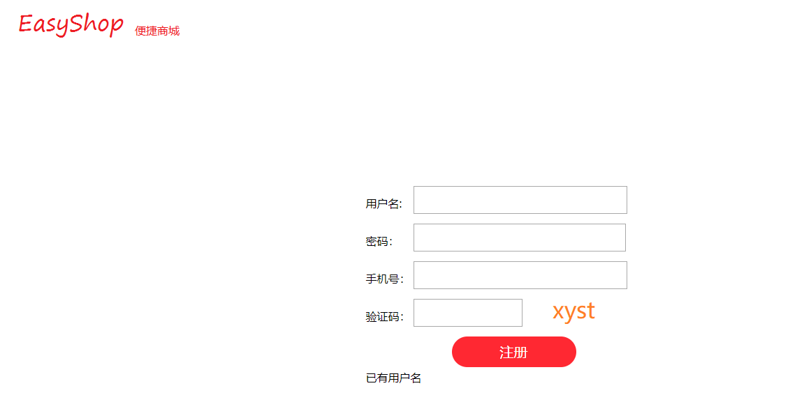
2.登录
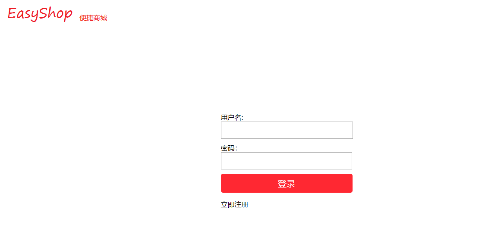
3.首页
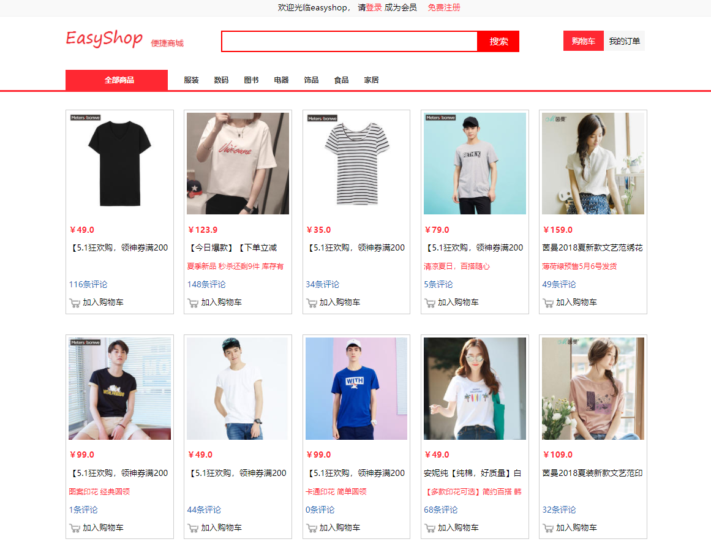
4.详情
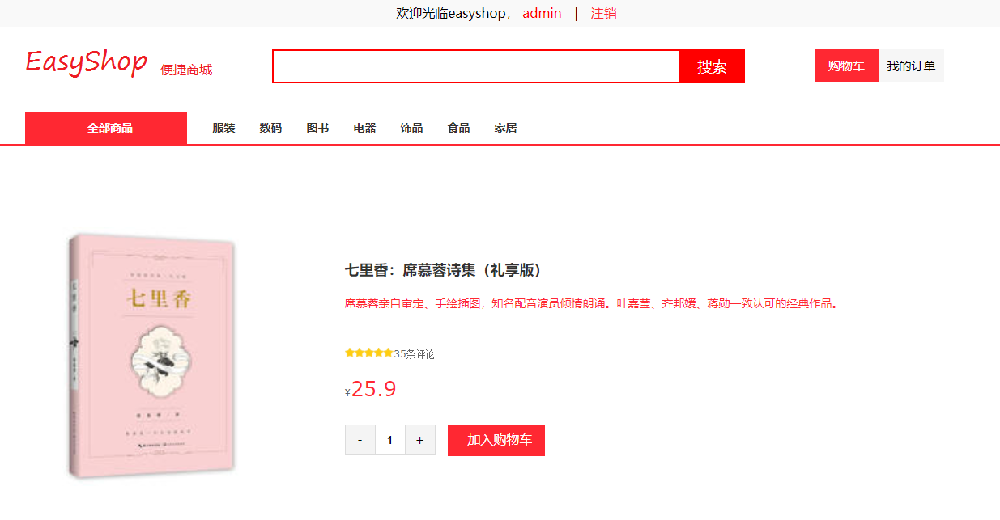
5.购物车
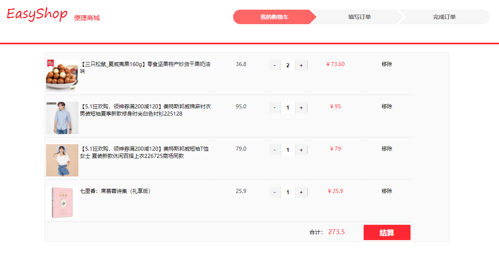
6.提交订单
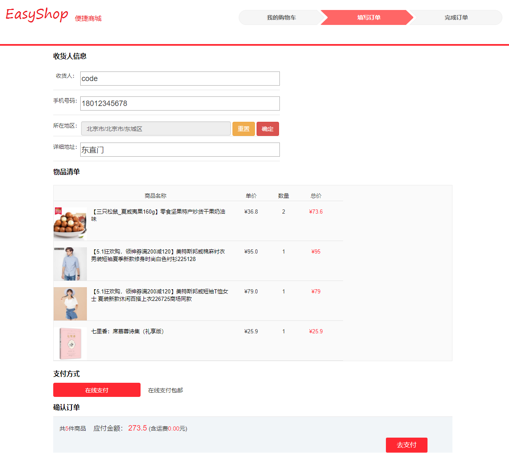
7.支付
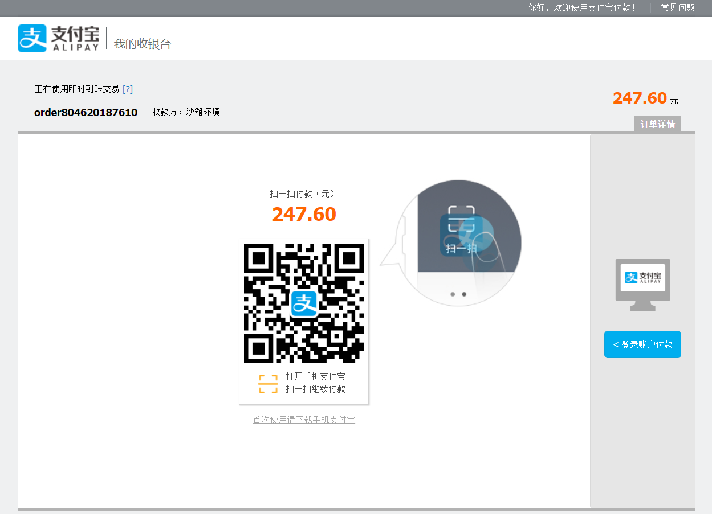
8.支付成功
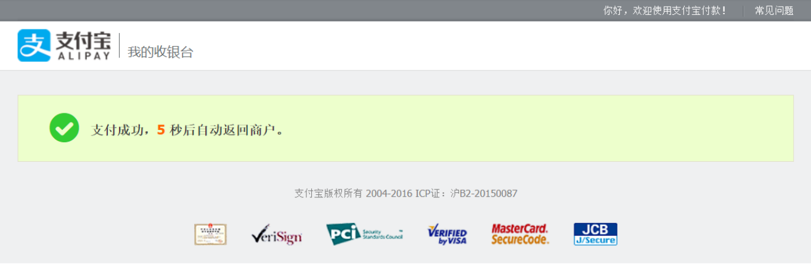
9.订单
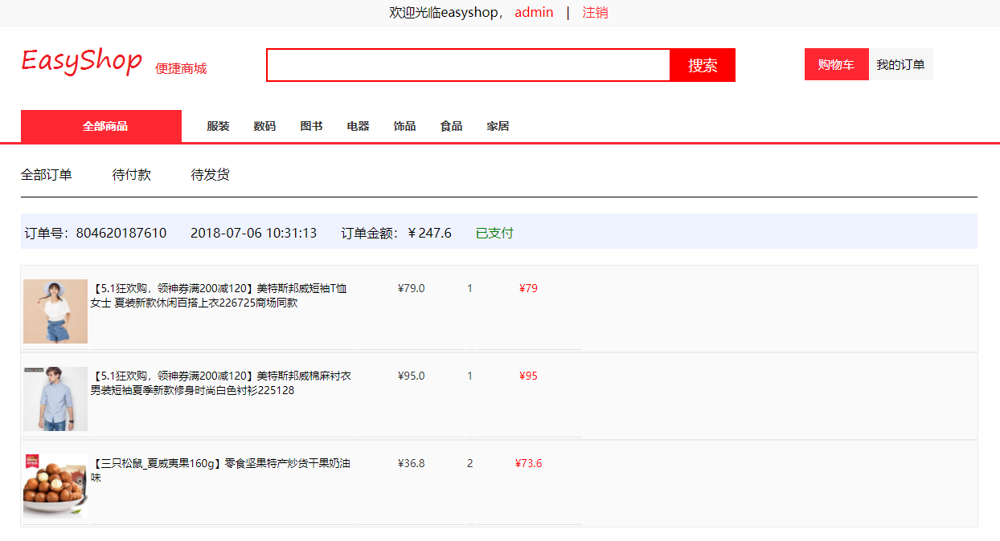
#### 二.管理员
1.用户管理
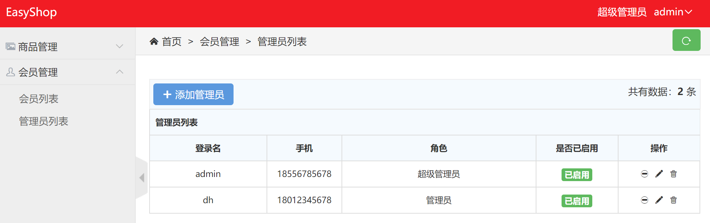
2.商品管理
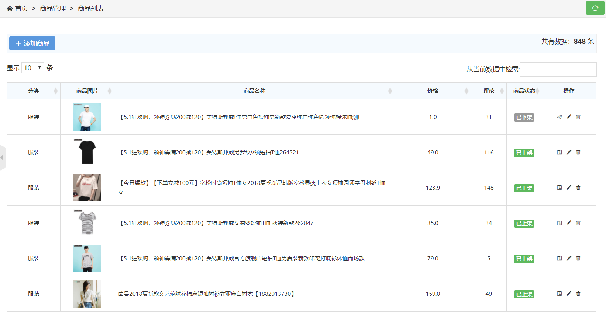
### 未完待续
### 实现代码
[web.demo.easyshop](https://github.com/lifoer/web.demo.easyshop)
### 后记
此项目为毕业设计，由于时间关系，制作还相对粗糙，只实现了商城的基础功能，细节之处还有待完善。
