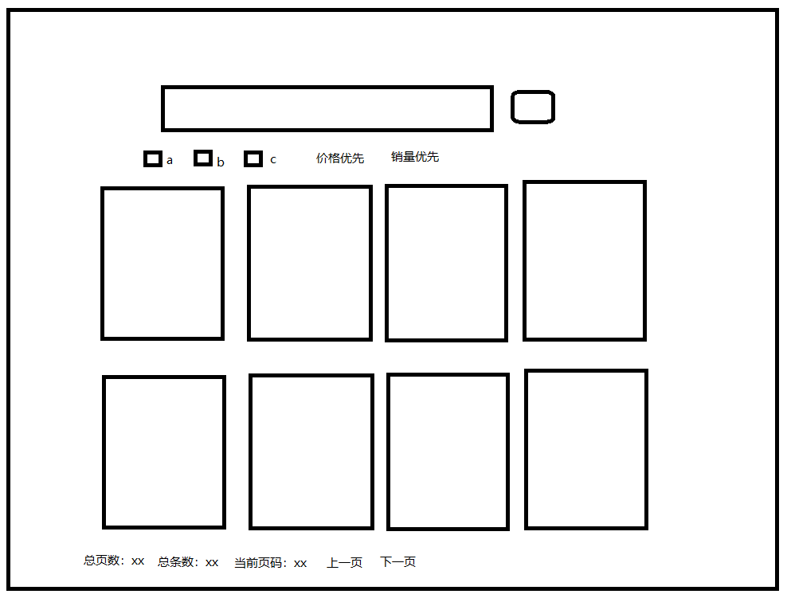
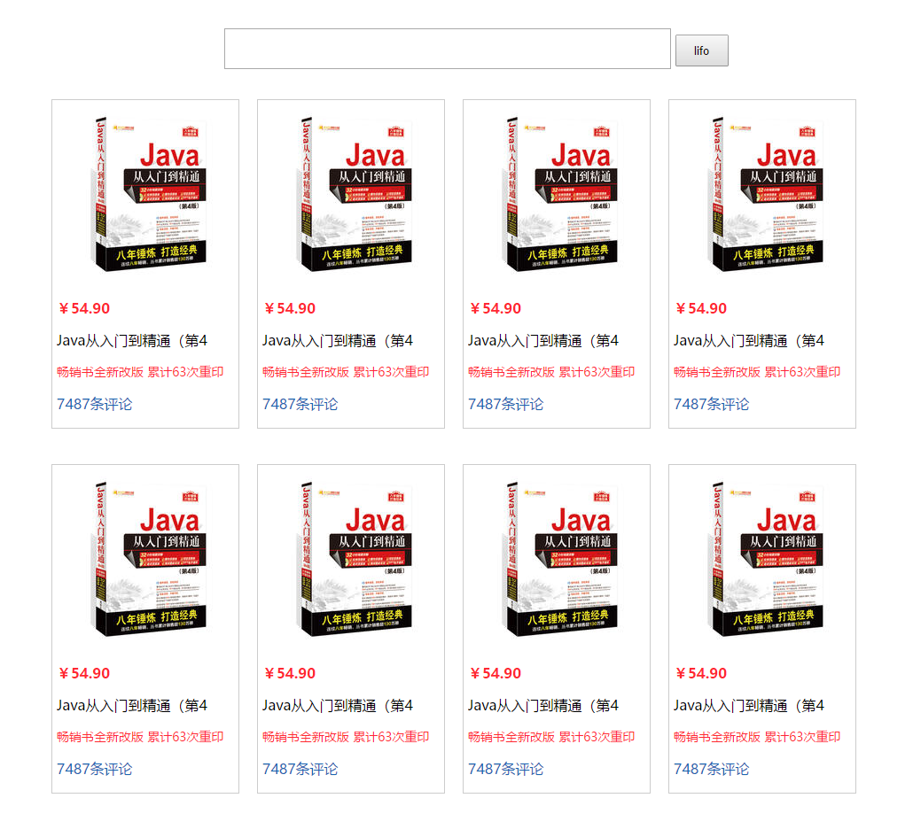
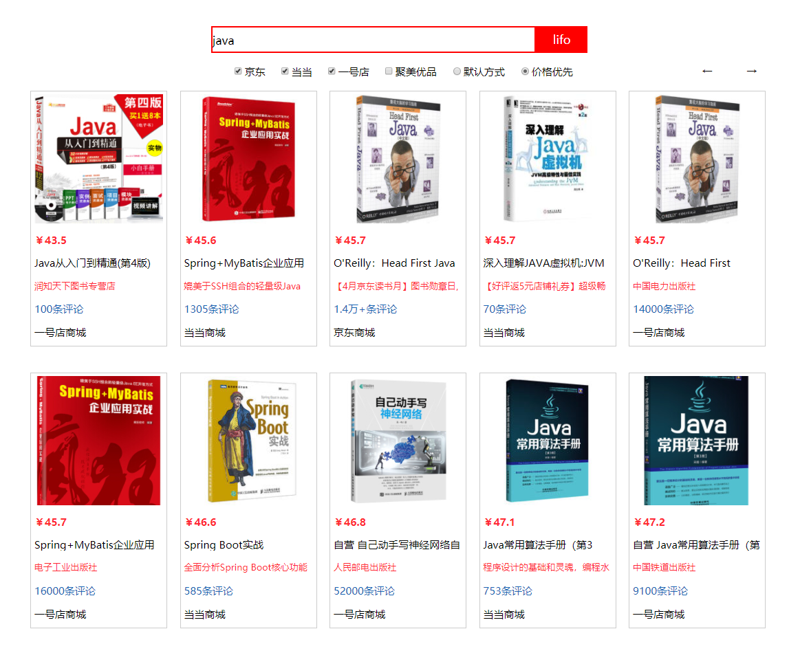
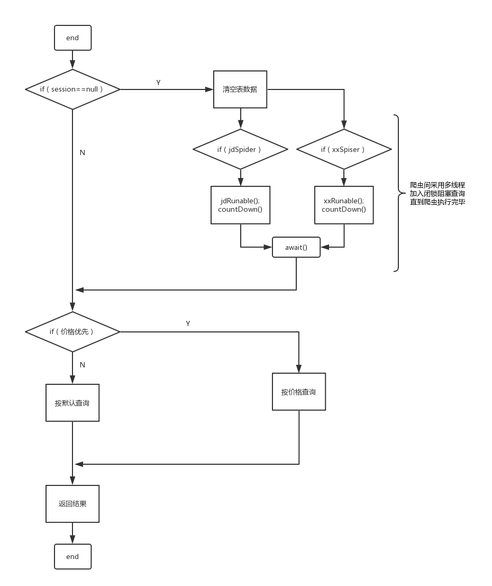

<!--more-->

## lifo实时比价系统的设计和思路分析

### 设计目标
做一个SSM框架的Demo，实现多个商城所查商品的实时比价。

### 思路分析
1.如何实现业务逻辑？
~~1>爬取数据存到数据库，按价格排序。可以比价，不能实时。~~ 
~~2>爬取数据存到集合，直接返回。可以实时，无法在不同商城间比价。~~
~~3>每次爬取数据前删除表数据，可以实现实时比价。但每次查询都要执行删除写入操作，并发量不高。~~
4>在3的基础上加入session，同一个session直接查询数据库，不同session再重新爬取。最终方案。

### 难点分析
1.之前词频分析系统已经搭建过SSM框架，框架搭建不是难点。
2.因不擅前端布局，前端页面是本次系统难点之一。
3.设计多线程系统，加快数据的获取，是本次系统难点之二。
4.爬虫获取各大商场数据，是本次系统最大难点。
5.处理系统间细节，小而精，做到完美，是本次系统难点之四。

### 系统历时
实现4.5天+总结0.5天

### 设计思路

#### 一、界面设计
1.mspaint设计图

2.html初稿

3.系统最终版

#### 二、爬虫设计
##### 1.总体思路
使用HTML解析器Jsoup发起get请求，获取document对象（html源码），通过css选择器获取Elements对象（标签名），通过属性名获取所需数据。

##### 2.实际遇到的难点

Ⅰ.请求链接的获取。
> ⅰ.为了使请求链接适用于所有商品，必须找到通用的请求链接。
> ⅱ.请求链接要动态拼接关键词和页码数。

Ⅱ.滚动加载数据的获取
> i.有些网站滚动加载为请求链接拼接滚动参数。如：scrolling=y。
> ii.有些网站会针对滚动加载重新发起ajax请求。需要获取ajax链接，重新发起请求。

III.标签名的混淆
> i.标签名带空格。要分开获取。如class="a b" 。需要select(".a").select(".b")获取。
> ii.标签名大量重复混淆。要选择关键标签，避免无必要重复标签。

IIII.属性名的更改
> i.某些商品突然更改属性名。多层if判断，如果第一个属性名的内容为空，获取第二个属性名的内容。

Ⅴ.请求头的检测
> i.对于普通请求加入浏览器的请求头，主要参数为cookie和User-Agent。
> ii.对于ajax请求要加入Referer参数。

Ⅵ.Ajax请求或post提交
> i.有些网站关键参数，如：价格等会通过ajax请求获取json。
> ii.有些网站请求链接中看不到页码或关键字参数，为post提交或ajax请求。
> iii.需要通过正则表达式解析json获取数据。

Ⅶ.多次请求验证码
> i.暂未解决。ocr框架或是途径之一。

#### 三、逻辑设计

#### 四、小而精美
1.对于个别获取不到的价格，el表达式判断价格是否大于0，否则显示“暂未获取价格”。
2.对于关键词为空或未勾选商城，不予查询。
3.采用穷举测试，多种关键词搜索，排除爬虫异常。
4.异常输出到日志文件，方便排查。

#### 五、不足之处
逻辑相对简单，只设计了一张表。本次查询如果和上次查询session不同就会删除session重新爬取数据，无法应对很高的并发量。

