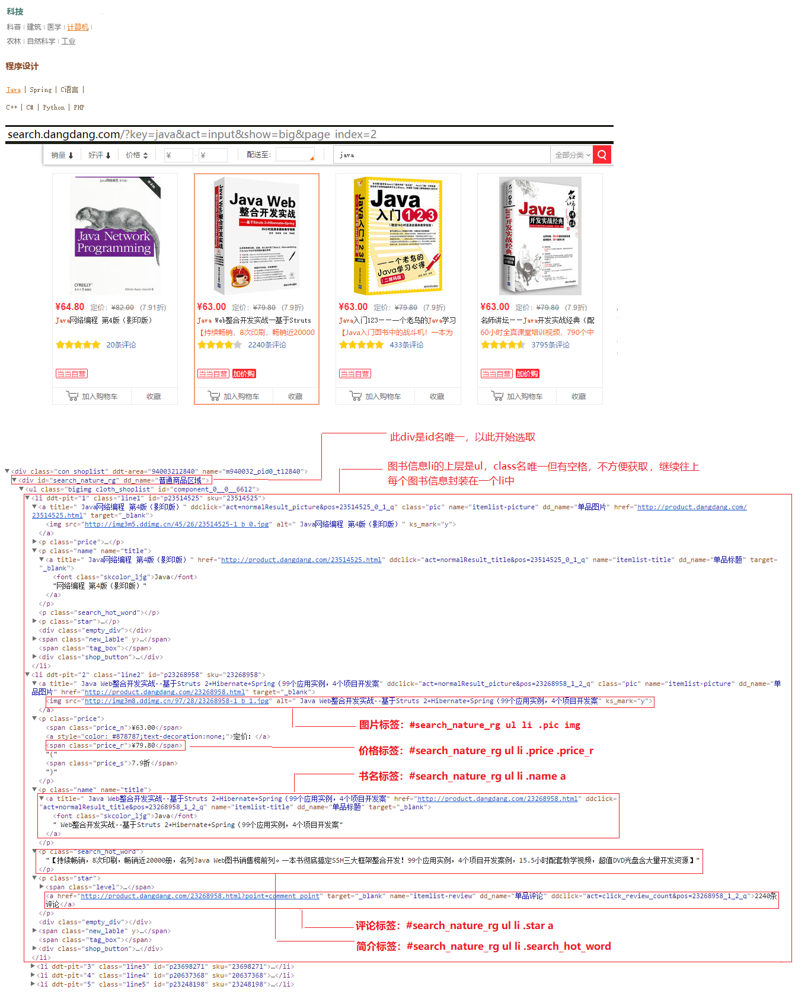
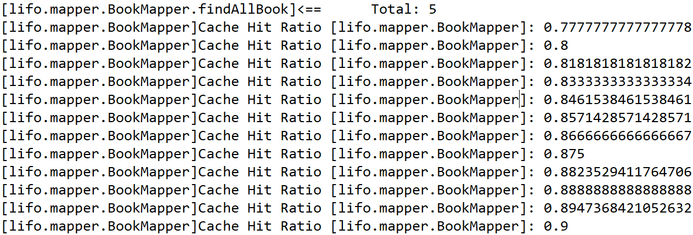

<!--more-->


## lifo搜索词频分析系统的详细设计和思路


#### 设计目标：
做一个SSM框架的Demo，实现某种物品的分页查询、关键词搜索，用Redis缓存减轻Mysql压力实现高并发。并对搜索结果进行记录，通过Flume收集到HDFS系统，通过MapReduce进行处理，导出到Mysql中，通过Echarts做搜索热词排行榜。

#### 设计原则：
尽量简化业务逻辑，主要加深对知识的应用。选什么物品实现业务逻辑呢，当然是书了，书籍是人类进步的阶梯。

#### 系统历时：
实现10天+总结2天

#### 具体实现：

以下实现中的详细配置和代码见仓库。[web.demo.hotword](https://github.com/lifoer/web.demo.hotword)

1.使用前端开发神器SublimeText3，安装Emmet插件，高效编写html页面。	--> index.html、index.css

2.用PowerDesigner建模工具设计表。这里只有一张表，也可以手动创建。

创建lifo数据库和book表，并插入一条测试数据。	-->lifo数据库、book表

```
CREATE DATABASE /*!32312 IF NOT EXISTS*/`lifo` /*!40100 DEFAULT CHARACTER SET utf8 */;

USE `lifo`;

DROP TABLE IF EXISTS `book`;

CREATE TABLE `book` (
  `no` varchar(100) NOT NULL,
  `name` varchar(100) default NULL,
  `price` double default NULL,
  `comment` int(11) default NULL,
  `img` varchar(100) default NULL,
  `des` varchar(1000) default NULL,
  PRIMARY KEY  (`no`)
) ENGINE=MyISAM DEFAULT CHARSET=utf8;
```
3.Eclipse导入Maven插件，方便jar包管理。

4.创建MavenProject的quickstart工程，lifo-parent，作为项目父工程，用来管理jar包。	--> lifo-parent工程
   修改pom.xml文件，导入预期所需jar包，并把Packaging类型改为pom。
  ps：只导入了SSM框架所需的jar包，后续需要什么继续添加。

5.创建MavenProject的webapp工程，lifo-web，作为项目主工程。	-->lifo-web工程

6.lifo-web工程resources目录下新建spirng配置文件，springmvc配置文件，mybatis配置文件，properties配置文件，搭建ssm环境。
->
resources/spring/：applicationContext.xml、applicationContext-transation.xml 、applicationContext-mybatis.xml 、springmvc-config.xml、
resources/mybatis/：mybatis-config.xml
resources/： jdbc-mysql.properties
resources/mybatis/mappers/：BookMapper.xml

1>为了方便spring文件的管理和后续扩展，将各项功能分开配置。也可配置到一个spring文件中。
> applicationContext.xml  spring 配置主文件。引入properties文件；开启包扫描。
> applicationContext-transation.xml  配置事务管理。
> applicationContext-mybatis.xml spring管理myabtis。配置mysql连接池；构造SqlSessionFactory交给spring管理（需配置数据库连接，引入mybatis配置文件，对mapper.xml的扫描，实体类的别名包）；配置对数据层(Dao层)的mapper接口扫描。
> 很快我们便会感觉到spring配置文件分类写的好处，之后需要创建applicationContext-redis加入redis缓存的时候，就不需要更改某些不相关的配置文件了，可以减少出错率。

2>springmvc配置文件
> springmvc-config.xml, 配置springmvc。配置开启springmvc注解，根据需要修改（我们后续项目返回json的时候就需要修改ResponseBody让返回json由fastjson解析）；开启包扫描（扫描controller层）；定义视图解析器（定义资源前缀和后缀）；防止静态资源拦截配置（若web.xml中访问的拦截为/*需配置此项，防止js，css等静态资源被拦截）。

3>mybatis配置文件
> mybatis-config.xml,配置mybatis配置，mybatis基本配置已配置于spirng整合文件中，可根据需求扩张。我们项目需要基本开启驼峰扫描（使表名和实体类大小写对应，Book实体类对应于book表。当然若表名复杂，此项无效，只能引入Table注解了）（我们后续项目中就需要配置log4j为默认日志输出类时，需要配置开启二级缓存）。mybatis插件，根据需要扩展（我们后续项目中就需要配置mybatis的分页插件实现物理分页查询）。

4>properties配置文件
> properties配置文件不是必须，可以直接将各项参数写入spring配置文件中，但是降低耦合性，建议这样创建properties文件。需要msyql配置文件jdbc-mysql.properties。（后续我们管理日志的时候需要配置log4j.properties，加入redis缓存的时候需要配置redis.properties）

5>mapper.xml配置文件
> XxMapper.xml是用来存放sql语句的，根据实际业务场景创建。是ssm框架中耦合性低的一种良好体现。
> 我们项目中第一个业务需要创建BookMapper.xml文件来存放各种查询语句。

7.修改webapp/WEB-INF/web.xml文件。  --> web.xml
> web.xml文件作为web程序的入口，是很重要的配置
> web.xml中各项配置的加载顺序： context-param ->listener -> filter -> servlet
> context-param中配置,指定spring配置文件路径。
> listener中配置，自动装配applicationContext的配置信息。
> filter中配置，编码过滤器，指定通用编码utf8为请求和响应编码。
> servlet中配置，springmvc分发器，需指定springmvc配置文件路径，加载此servlet的优先级，分发器拦截的url
> welcome-file-list中配置首页。
> error-page中配置错误或异常页面。

8.修改pom.xml文件，继承lifo-parent工程，添加tomcat插件，并指定访问页面的端口号（因为项目要用nginx代理，不需要设置80缺省，我们随便设一个不在使用中的端口即可，如：8090）。

我觉得在需要配置文件的时候，大可以复用别人的，但要三省吾身。每一项配置的作用是什么？你需要这项配置吗？这项配置会和别的配置冲突吗？需要的自己去补，不需要的注释掉。

9.WEB-INF目录下导入前台页面。--> index.jsp、index.css、logo.png
1>防止误删web.xml文件或方便分门别类，我们新建一个pages文件夹，新建jsp页面，为了后续使用jstl标签，我们引入jsp的核心类库。拷贝html.xml的内容到jsp中，在需要动态接收参数的地方用jstl标签改写。如果多人开发，或许写一个前端接口文档，方便后端直接使用。
2>同样的原因，我们在webapp目录下新建staticfile目录，在此目录下新建css文件夹，来存放index.css；新建image文件夹来存放logo.png（后续我们导入可视化页面时还需创建js文件夹来存放js脚本）。

10.至此，框架部分和前台已搭建完毕，需要分析我们的项目业务来实现后台功能了。

11.lifo-web工程，根据mvc分层思想，降低耦合性，我们创建lifo.controlelr，lifo.serviece，lifo.mapper，lifo.pojo包,并创建对应的类或接口。BookController，BookService接口，BookServiceImpl实现类，BookMapper接口，Book类来编写控制层（负责页面跳转或其他与业务无关操作），逻辑层（具体的逻辑实现应该写在此类中），数据层（对应具体的XxMapper.xml来实现数据查询），实体类（我的理解它算一个中间层，因为各层都需要用到，负责数据的封装）。

--> lifo.controlelr.BookController、lifo.serviece.BookService、lifo.serviece.BookServiceImpl、lifo.mapper.BookMapper、lifo.pojo.Book

12.为BookController类添加controller注解，交给springmvc管理，添加自动注入BookService接口。为BookServiceImpl实现类添加service注解，交给spring管理，添加自动注入BookMapper接口。而BookMapper和pojo已经由mybatis接手了。

13.基本代码架子已经搭完，编写实现代码和sql语句即可。具体代码详见代码仓库。

14.完成代码后，Eclipse中添加运行，用我们的tomcat插件让项目跑起来，去浏览器键入localhost：8090/index.html即可（我们实际是jsp页面，但是为了伪装静态页面，已在springmvc分发器指定拦截*.html）。

15.如有错误，根据Eclipse控制台和浏览器控制台查看异常，解决之。

16.加入nginx反向代理服务器。--> 加入nginx
> nginx有什么用？如果有多个项目，我们可以指定它在一个tomcat中运行，只需要配置好不同的路径即可，并可同时作为缺省应用。同时，方便不同系统间的调用。其次，如果有多台服务器，可以使用它实现负载均衡，从而实现高并发。
> 可以作为静态服务器。（我们项目中就主要用它来作为图片服务器）。

中间三行proxy配置为增加用户ip请求头给tomcat服务器，方便日志收集时获取用户ip。（此处就一并配置了）
（此处是不是去掉多层代理之后的真实ip就无从考证了，项目没上线，我自己访问收集到的只能是127.0.0.1）

```
 #index
    server {
    	listen 80;
    	server_name lifo.com;

        proxy_set_header Host $host;  
        proxy_set_header X-Real-IP $remote_addr;
        proxy_set_header x-forwarded-for $proxy_add_x_forwarded_for;

    	location / {
    		proxy_pass http://127.0.0.1:8090;
    		proxy_connect_timeout 600;
    		proxy_read_timeout 600;
    	}
    }
```

17.添加域名解析。实际就是修改hosts文件实现本地伪解析。

18.至此，项目已经初步完善了。不对，就一条数据，什么鬼。我们手动插入若干条数据吗？当然不。

19.创建MavenProject的webapp工程，lifo-spider，爬虫获取真实数据，存入数据库，方便后续测试。难题来了，怎么存入数据库，手写jdbc？c3p0连接池？都太繁琐了。简单点的，不是刚搭了SSM框架吗？既然不是web项目，那便去掉一个S，只用S、M框架。所以我新建的是webapp工程。

--> lifo-spider工程

20.拷贝lifo-web工程的resources中的配置文件，springmvc配置文件可以删了,BookMapper.xml修改sql语句还可以再用。修改pom.xml文件继承lifo-parent工程。

-->
resources/spring/：applicationContext.xml、applicationContext-transation.xml 、applicationContext-mybatis.xml 
resources/mybatis/：mybatis-config.xml
resources/： jdbc-mysql.properties
resources/mybatis/mappers/：BookMapper.xml

20.新建 各种包、接口、类，lifo.controlelr.BookController、lifo.serviece.BookService接口、lifo.serviece.BookServiceImpl、lifo.mapper.BookMapper接口。

-->lifo.controlelr.BookController、lifo.serviece.BookService、lifo.serviece.BookServiceImpl、lifo.mapper.BookMapper

既然没有springmvc，为什么还添加controller包？controller包名只是一个代号，代表的是此层是控制层，我们实际写了一个main方法来调用Service层，通过对set方法添加自动注入，来实现BookService的静态自动注入。（而且看源码，controller注解也是spring的注解，而不是springmvc的，只是可能可以交给springmvc管理吧。）

为什么没有pojo，我们实际需求的封装数据只需2个字段，而实体表中有多个字段，便不使用实体类了。而且我们只涉及到查询业务，使用map封装数据一样方便。用什么封装看具体哪种方式方便了，不能一概而论。

21.工欲善其事必先利其器。接下来便是选用api来实现爬虫了。我此前了解到的有三种，httpclient，jsoup，javase原生。或许，也有一些框架，有更强大的特性，只能以后研究了。

jsoup提供了很好的css选择器，很方便抓取页面。而且也可设置一些请求头来简单伪装真实访问，在小规模爬虫中或许可以起到一定的防反爬虫作用。我们便用它来抓取数据了。
而javase原生类中提供了根据url获取输入流的方法，我们便用它来下载所需的图书封面。
而httpclient呢，自然也不会落入平阳，它强大的请求功能自有用武之地，后续用到再说。

22.万事具备，只缺一个网站了。既是图书，便选当当了。每到图书打折的时候，我还是会经常光顾的。

1>打开当当，爬什么类目呢？文学，no，当然是计算机图书了，然后java。

2>然后选择第二页（为了在地址栏获取get提交的页码信息）。

3>去掉url中无用信息，确保此链接可以访问到目标。此链接便是我们用jsoup发起请求的链接。

4>F12打开浏览器调试模式。谷歌或猎豹或360极速浏览器较好用。选择Elements标签（默认就是），点击左上角的箭头，然后指向我们要获取的信息处，便可看到它在html中的标签位置，一般通过class名或id名便可获取。

5>为了准确定位，选用class时可以多指定几层，加上它的父标签、爷爷标签，目的是确保唯一性。id是唯一的，便可大胆选择。有时，也可用属性选择器，或有奇效。css选择器还有很多，不一而足，只做抛玉。

6>有的网站，部分数据会用ajax加载，抓取html是获取不到的，可以在Network中看到请求链接。一般是json封装的，我们可以在html中抓取到其请求链接，模拟发起请求，通过正则解析出需要的数据。

7>回到测试页面，测试所得，我们要爬的这个页面没有防爬虫机制，测试所需数据也均可通过css选择器获取。
分析可得，它是用li标签封装每个图书信息的，它的上级标签是ul标签唯一但有空格不方便选取。继续向上，上级div是id选择器唯一，便以它开始。具体分析详见下图。



23.爬虫工程到此结束，具体代码详见仓库。我们可以传入对应关键字获取不同种类的信息，为了数据质量，每个关键字只获取一页数据，获取上千条，足够分析使用了。至此，mysql数据库建好了，去访问一下。

24.怎么能看到图书封面呢，用nginx简单配置一个图片服务器。

```
#image
server {
	listen 80;
	server_name image.lifo.com;

	location / {
		root d://lifo;
	}
}
```

25.新的问题出现了，我的页面被数据撑爆了。少年，你没分页吧。确实，之前一条测试数据的时候，哪管什么分页啊，现在上千条涌入。

26.用什么分页呢，controller层控制吗？这是一种逻辑分页的思想，这样貌似解决了当下问题。可当数据量更大时，对数据库不是一个友好的措施，每次查询全部，实际却用几条，不是浪费吗。

27.为了杜绝资源的浪费，我们采用物理分页的方式，用多少取多少。引入mybatis的分页插件pagehelper。这款插件简单易用，耦合性很低，只需3步即可，简直神器也。 

-->引入PageHelper

[PageHelper](https://github.com/pagehelper/Mybatis-PageHelper)

1>lifo-parent的pom.xml中引入。

```

<dependency>
  <groupId>com.github.pagehelper</groupId>
  <artifactId>pagehelper</artifactId>
  <version>5.1.2</version>
</dependency>
```
2>在mybatis-config配置文件引入。

```
<plugins>  
    <plugin interceptor="com.github.pagehelper.PageInterceptor">    
        <!-- 分页参数合理化 -->  
        <property name="reasonable" value="true"/>  
    </plugin>  
</plugins>  
```
3>在controller层只需用两行代码包住查询语句即可。

```java
//页码，每页显示的数目
PageHelper.startPage(pageNum, 5);
List<Book> bookList = bookService.findAllBook();
pageInfo = new PageInfo<Book>(bookList);
```

28.改写前台页面，加入页码控制。

```
当前页码：pageInfo.pageNum
总页数：pageInfo.pages
总条数：pageInfo.total
是否有上一页：hasPreviousPage
是否有下一页：pageInfo.hasNextPage
```
29.再次运行项目，清爽很多，分页功能实现。

30.我们每次查询数据都是固定的，但每次数据都需要从数据库中获取，而mysql数据库是持久化到磁盘上的，访问速度受限。再则，如果访问人数足够多，数据库响应不过来呢。所以有必要引入缓存机制，用Redis内存数据库来提高数据查询效率，实现高并发。

-->引入Redis缓存

31.Vm虚拟机中安装Centos系统，安装并配置一台Redis。

32.怎么引入Redis呢，写一个Jedis工具类在Service层调用吗？demo中为了简化实现，使用Redis作为Mybatis的二级缓存，让Mybatis自己去管理缓存。

33.需要编写RedisCache类去继承Mybatis缓存类Cache，并编写RedisCacheTransfer中间类，用于注入静态对象jedis连接工厂。
创建spring管理jedis的配置文件applicationContext-redis.xml，redis配置文件redis.properties。

-->lifo.cache.RedisCache、lifo.cache.RedisCacheTransfer、resources/spring/applicationContext-redis.xml、
resources/redis.properties

34.使用日志管理类log4j打印mybatis日志，配置log4j.properties文件，修改mybatis默认的日志打印参数。
mybati打印日志优先级：SLF4J -> Apache Commons Logging ->  Log4j 2 -> Log4j -> JDK logging
可以看到log4j优先级很低，myabtis-config.xml的settings标签添加

```
<!-- 指定日志输出log4j -->
<setting name="logImpl" value="LOG4J"/>
```
-->resources/log4j.properties

> 实际使用中发现log4j配置文件最好放在classpath根路径下，否则需要在web.xml中spring加载前导入。

35.重新启动工程，在查询时候可以看到，控制台输出的Myabtis缓存数据命中信息，当多次访问后，命中率为1，这时我们的数据便完全从Redis中获取了。试着，去宕掉你的数据库，就是关闭数据库服务，查询照样进行。因为当缓存中存在本次查询的key时，它会默认中缓存中获取value。



有一些问题：

> 1>.为什么不直接用Mybatis的二级缓存呢？Mybatis的二级缓存只是本地缓存机制，Redis可以作分布式集群缓存，Redis的读写效率在大数据下更高。

> 2>.Mybatis二级缓存有什么问题？Mybatis的二级缓存范围是一个命名空间中（XxMapper.xml文件），粒度太粗，只要存在增删改操作，就会清空当前命名空间下的所有二级缓存。并且在多个命名空间中，还会发生因一个命名空间发生增删改操作，而另一个命名空间没有自动更新缓存产生脏读的问题。由于Myabtis二级缓存的特性，会导致这样配置的Redis可用性不高。

> 本demo中只涉及到少量数据，只存在一个命名空间，只涉及到查询操作，为了简化流程只作为测试使用。

>  实际项目中，Myabtis二级缓存可用性不高，建议写jedis工具类，自己在Service层管理缓存。

36.若搜索时关键词不为空，便将搜索记录同时写出本地文件和Flume中。需要自定义log4j日志级别，输出指定的日志信息。
访问ip，关键词，访问时间。

37.写自定义日志类CustomLog，单例，封装外部调用的静态方法。主要方法为设置输出本地文件的Appender对象和设置输出Flume的Appender对象。此处可以查看flume-ng-log4jappender的api封装对应的参数。

-->lifo.log.Customlog

38.安装Flume，编写本例conf文件，将收集到的数据按天写出到HDFS中，为方便使用并编写Flume启动和关闭的shell脚本。[Flume安装和简单使用](https://lifoer.github.io/2018/04/04/Flume安装与简单使用)

29.安装Hadoop，配置Hadoop伪分布式，需要用HDFS系统存储Flume收集到的日志，并用MapReduce进行计算。[Hadoop安装与简单使用](https://lifoer.github.io/2018/04/04/Hadoop安装与简单使用)

30.安装Hive，简化Hadoop的MapReduce操作，创建外部表word_src导入HDFS的日志数据，创建内部表word_count插入word_src统计后的数据。[Hive安装与简单使用](https://lifoer.github.io/2018/04/04/Hive安装与简单使用)

31.安装Sqoop，将Hive统计数据写出到mysql，这里写出到了Centos的mysql中。（而前面使用的是windows中的mysql）。
[Sqoop安装与简单使用](https://lifoer.github.io/2018/04/04/Sqoop安装与简单使用/)

32.编写脚本自动执行，并加入llinux定时任务中
> 为了模拟真实使用场景，本脚本需实现：每天凌晨2时自动后台执行，Hive导入HDFS中数据，经过MapReduce运算，再用Sqoop导出Mysql中，并按天生成执行日志。
[自动实现脚本](https://lifoer.github.io/2018/04/04/Hive安装与简单使用/#四-脚本执行)

33.日志自动收集实现了，可日志呢？前台手动输入关键词获取吗？no，我们要获取很多数据来分析，当然是自动化了。该HttpClient登场了。

34.lifo-spider下编写类FeignRequest 。设置好一些关键词，每次随机获取一个，封装到map中，用httpclient向我们的前台发起发起post提交，然后坐享其成。3分钟后10000次请求好了。浏览器中查看hdfs系统中确实收集到了一万条日志记录。

35.增加一个linux定时任务，时间为下一分钟，运行我们的脚本，完成centos中mysql数据的导入。

36.选择合适的Echarts图表做热词可视化，根据场景选择了字符云、饼形图、柱形彩虹图。编写html页面，加入Echarts的js。

37.为了按日期选择数据，使用flatpickr日期插件。

38.测试页面后导入jsp。--> view.jsp

39.问题又产生了，我们使用的Book业务使用的windows中的数据库，而word业务要使用linux中的数据库。一个系统中可以使用多个数据库吗？答案是肯定的。Mybatis的缓存虽然不好用，但其他功能还是很强大的。只需在applicationContext-mybatis.xml文件中添加一套配置即可。配置一个dataSource2、SqlSessionFactory2，MapperScannerConfigurer中扫描mapper2文件夹。在jdbc-mysql.properties中加入另一个数据库的参数。

40.创建lifo.controller.WordController，lifo.service.WordService接口，lifo.service.WordServiceImpl,lifo.mapper2.WordMapper,添加相应注解，自动注入相关类。复制BookMapper.xml为WordMapper.xml。

-->lifo.controlelr.WordController、lifo.serviece.WordService、lifo.serviece.WordServiceImpl、lifo.mapper2.WordMapper、
resources/mybatis/mappers2/WordMapper.xml

41.前台怎么接受数据呢？Echarts需要的是json串。name：value形式。
后台怎么传数据呢？查询数据用map封装，然后使用阿里巴巴的fastjson，非常方便的把集合对象转换为json串。
[FastJson](https://github.com/alibaba/fastjson)

42.在controller层使用RequestBody注解，返回json值。测试，中文乱码了。

43.原来RequestBody是按照springmvc默认的方式解析json的，需要在spingmvc-config.xml中配置使RequestBody注解来通知springmvc由fastjson解析json。

```
<mvc:annotation-driven>
	<!--配置@ResponseBody由fastjson解析-->
             <mvc:message-converters>
              <bean class="org.springframework.http.converter.StringHttpMessageConverter">
                     <property name="defaultCharset" value="UTF-8"/>
              </bean>
              <bean class="com.alibaba.fastjson.support.spring.FastJsonHttpMessageConverter"/>
             </mvc:message-converters>
</mvc:annotation-driven>
```
44.这时浏览器查看json串中文显示正常，考虑Echarts怎么获取json串。为了良好的视觉体验，使用Ajax异步请求来获取数据，为了简化js编写，使用jquery的ajax方法。

45.到此，项目便结束了。项目到开始到结束用了10天，算是对近期所学杂乱知识的简单实践。总结文档写了2天，也发现了很多不完善的地方。知也无涯，路还远兮。

### 写总结文档的过程中暂时发现项目中2个可以优化的地方。
> 其一.便是放弃Mybatis的二级缓存，自己管理缓存。
> 其二.项目中spring配置文件还是很繁琐的，或许可以去学习SpringBoot来简化配置。


