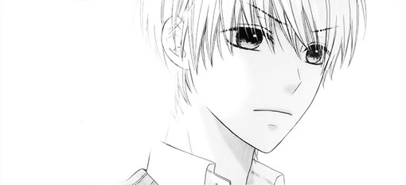

<!--more-->

万里归来年愈少，笑时犹带岭梅香。
-题记

谁翻到那篇从前慢，
泛黄的书签，
是装着相片的笺。

谁打开褪色的照片，
最后一排的少年，
他微笑的腼腆。

盛夏阳光的灿烂，
不及他笑的烂漫，
那是六月的一天。

风飘过的瞬间，
留言簿的字迹已干，
是他未说出的遗憾。

谁说世间美味的饭，
不过一份简单的拉面。
谁说世间不解的缘，
不过一句无言的致歉。

谁知蜀道之难，
不及没有要求的门槛。
谁知学步邯郸，
不及虚妄完美的荒诞。

成年是道坎，
浮世半生的辗转，
能否还有澄澈的眼。

少年，
我已记不起他的容颜，
少年，
也是一阵烟。
少年，
不老的心弦。

《少年的歌》，6.1。
