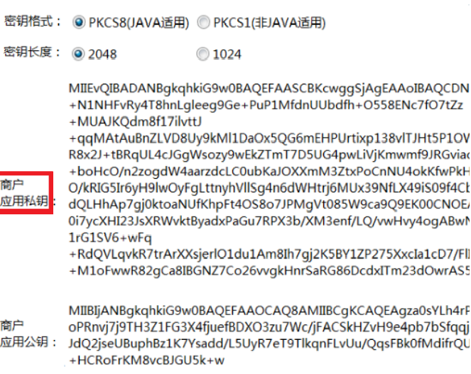
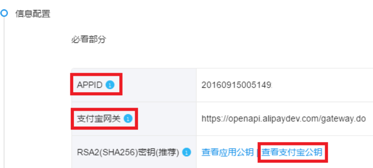
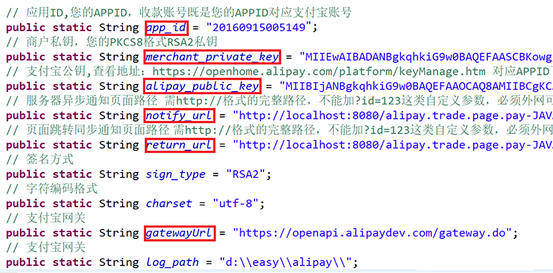
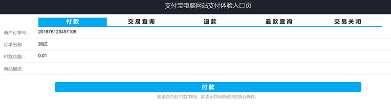

沙箱支付

<!--more-->

> 支付宝模拟支付环境。

### 一、demo使用

1.java版sdk：https://docs.open.alipay.com/270/106291/
2.导入demo至eclipse。
3.支付宝账号登录蚂蚁金服开发平台：https://open.alipay.com/platform/home.htm
4.参照开发指南，配置沙箱应用。https://docs.open.alipay.com/200/105311/
5.使用RSA签名验签工具生成应用密钥。

6.配置应用公钥，https://openhome.alipay.com/platform/appDaily.htm?tab=info

7.配置AlipayConfig.java文件中主要参数。
*若要测试异步通知，必须要求异步通知地址外网可以访问到，本地测试可以借助花生壳内网穿透。

5.通过tomcat启动，访问 localhost:8080/alipay.trade.page.pay-JAVA-UTF-8/
6.通过测试页面进行支付测试。


### 二、项目使用

1.maven依赖

```
<dependency>
	<groupId>com.alipay.sdk</groupId>
	<artifactId>alipay-sdk-java</artifactId>
	<version>3.0.0</version>
</dependency>	
```
2.订单支付，可参考demo中alipay.trade.page.pay.jsp。

> I.部分后端代码

```java
/**
 * 订单支付
 * @param orderId 订单号
 * @param amount 支付金额
 * @return
 */
@Override
public String payOrder(String orderId, String amount) {
	// 获得初始化的AlipayClient
	AlipayClient alipayClient = new 
    DefaultAlipayClient(AlipayConfig.gatewayUrl, 		  
    AlipayConfig.app_id,AlipayConfig.merchant_private_key, "json", 
    AlipayConfig.charset, 
    AlipayConfig.alipay_public_key,AlipayConfig.sign_type);
	// 设置请求参数
	AlipayTradePagePayRequest alipayRequest = new 
    AlipayTradePagePayRequest();
	alipayRequest.setReturnUrl(AlipayConfig.return_url);
	alipayRequest.setNotifyUrl(AlipayConfig.notify_url);
	Map<String, String> map = new HashMap<String, String>();
	try {
		// 商户订单号，商户网站订单系统中唯一订单号，必填
		String out_trade_no = URLEncoder.encode(orderId, "UTF-8");
		// 付款金额，必填
		String total_amount = URLEncoder.encode(amount, "UTF-8");
		// 订单名称，必填
		String subject = URLEncoder.encode("order" + orderId, "UTF-8");
		// 商品描述，可空
		String body = URLEncoder.encode("", "UTF-8");
		alipayRequest.setBizContent("{\"out_trade_no\":\"" + 
        out_trade_no + "\"," + "\"total_amount\":\""
				+ total_amount + "\"," + "\"subject\":\"" + subject + 
        "\"," + "\"body\":\"" + body + "\","+ 
        "\"product_code\":\"FAST_INSTANT_TRADE_PAY\"}");
		// 请求
		String result = alipayClient.pageExecute(alipayRequest).getBody();
		// 输出
		result = result.replaceAll("<input type=\\\"submit\\\" 
        value=\\\"立即支付\\\" style=\\\"display:none\\\" >", "")
				.replaceAll("<script>document\\.forms\\[0\\]\\.submit\\
        (\\);</script>", "").replaceAll("\n", "");
		map.put("data", result);
		String json = JSON.toJSONString(map);
		return json;
	} catch (Exception e) {
		e.printStackTrace();
		map.put("data", "null");
		String json = JSON.toJSONString(map);
		return json;
	}
}
```
> II.部分前端代码

```javascript
//生成订单号
function GetDateNow() {
	var vNow = new Date();
	var sNow = "" + (Math.floor(Math.random()*9000) + 1000);
	sNow += String(vNow.getFullYear());
	sNow += String(vNow.getMonth() + 1);
	sNow += String(vNow.getDate());
	sNow += String(vNow.getHours());
	sNow += String(vNow.getMinutes());
	sNow += String(vNow.getSeconds());
	sNow += String(vNow.getMilliseconds());
	sNow = sNow.substring(0,12);
	return sNow;
}
//点击支付按钮，提交收货人信息，发起支付请求。
$(function() {
	$("#button_zf").click(function() {
		var orderId = GetDateNow();
		var name = $("#inp_name").val();
		var phone = $("#inp_phone").val();
		var address = $("#city-picker3").val() + $("#inp_address").val();
		var userId = $("#inp_userId").val();
		var amount = $("#price_sum").text();
		$.ajax({
			type: "post",
			url: "submitOrder.html",
			data: {
				'orderId': orderId,
				'name': name,
				'phone': phone,
				'address': address,
				'userId': userId,
				'amount': amount
			},
			success: function(result) {
				var jsonObj = JSON.parse(result);
				if( jsonObj.data != "null") {
					$(jsonObj.data).appendTo('body').submit();
				} else {
					alert("订单提交失败，带来的不便请您谅解，请重新下单！");
				}
			},
			error: function(errorMsg) {
				alert("订单提交错误，带来的不便请您谅解，请重新下单！");
			}
		});
	});
});
```
3.异步通知，可参考demo中notify_url.jsp。
*同步通知用来通知用户，异步通知用来通知服务器。

```java
	/**
	 * 支付宝异步通知
	 * @param request
	 * @return 返回json字符串
	 */
	@SuppressWarnings("unchecked")
	@ResponseBody
	@RequestMapping("notifyUrl")
	public String notifyUrl(HttpServletRequest request) {
		try {
			Map<String, String> params = new HashMap<String, String>();
			Map<String, String[]> requestParams = request.getParameterMap();
			for (Iterator<String> iter = requestParams.keySet().iterator(); iter.hasNext();) {
				String name = (String) iter.next();
				String[] values = (String[]) requestParams.get(name);
				String valueStr = "";
				for (int i = 0; i < values.length; i++) {
					valueStr = (i == values.length - 1) ? valueStr + values[i] 
                    : valueStr +  values[i] + ",";
				}
				// 乱码解决，这段代码在出现乱码时使用
				valueStr = new String(valueStr.getBytes("ISO-8859-1"), "utf-8");
				params.put(name, valueStr);
			}
			boolean signVerified = AlipaySignature.rsaCheckV1(params,
            AlipayConfig.alipay_public_key,
			AlipayConfig.charset, AlipayConfig.sign_type); // 调用SDK验证签名
			if (signVerified) {// 验证成功
				// 商户订单号
				String out_trade_no = new String(request.getParameter("out_trade_no")
                .getBytes("ISO-    8859-1"), "UTF-8");    
				// 支付宝交易号
				String trade_no = new String(request.getParameter("trade_no")
                .getBytes("ISO-8859-1"), "UTF-8");
				// 交易状态
				String trade_status = new String(request.getParameter("trade_status")
                .getBytes("ISO-8859-1"), "UTF-8");
				// 交易金额
				String total_amount = new String(request.getParameter("total_amount")
                .getBytes("ISO-8859-1"), "UTF-8");
				if (trade_status.equals("TRADE_FINISHED")) {
					// 判断该笔订单是否在商户网站中已经做过处理
					// 如果没有做过处理，根据订单号（out_trade_no）在商户网站的订单系统中查到该笔订单的详细，并执行商户的业务程序
					// 如果有做过处理，不执行商户的业务程序
					// 注意：
					// 退款日期超过可退款期限后（如三个月可退款），支付宝系统发送该交易状态通知
				} else if (trade_status.equals("TRADE_SUCCESS")) {
					orderService.updateOrderInfo(out_trade_no);
					orderService.insertOrderPay(out_trade_no, trade_no, total_amount);
				}
				return "success";
			} else {// 验证失败
				return "fail";
				// 调试用，写文本函数记录程序运行情况是否正常
				// String sWord = AlipaySignature.getSignCheckContentV1(params);
				// AlipayConfig.logResult(sWord);
			}
		} catch (Exception e) {
			e.printStackTrace();
			return "fail";
		}
	}
```


