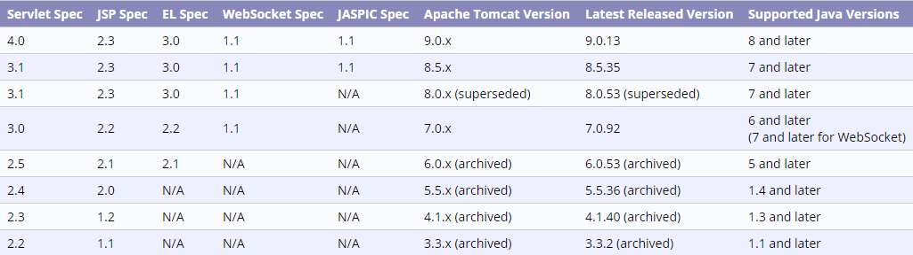
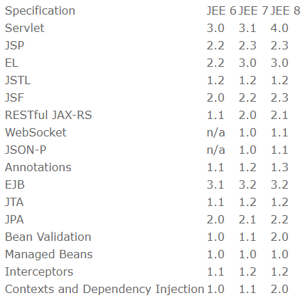

没有分类的一些记录


<!--more-->


1.python安装PIT模块

```
conda install pillow
```

2.python安装skimage模块

```
conda install scikit-image
```


3.eclipse中xml报错
No grammar constraints (DTD or XML Schema) referenced in the document.

```xml
<?xml version="1.0" encoding="UTF-8"?>
<!DOCTYPE xml>
```

4.tomcat-servlet-jsp 版本映射
http://tomcat.apache.org/whichversion.html


5.servlet-jstl 版本映射
https://www.javasprint.com/java_training_tutorial_blog/java_jee_jsp_servlet_story_jsf_jstl_el_history.php
http://tomcat.apache.org/taglibs/standard/


6.git警告
 warning: LF will be replaced by CRLF in xxx.

```
 git config core.autocrlf false
```

7.git命令

```
#查看待提交文件
git status
#查看提交日志
git log 
#查看详情，查询出来的commit id
git show 'commit id'
#退出
q
```

8.windows关闭占用端口进程

```
netstat -ano|findstr 8080
taskkill /f /pid 7556
```

9.linux删除文本中^M
1.^M引起原因：“\r”回车符
2.查看^M

```
cat -A file.txt
```

3.删除^M，^M不可复制，手动按出：ctrl+v+m

```
cat file.txt | tr -d "^M" > newfile.txt
```

4.批量处理
* 1). 批量删除

```
#!/bin/bash
for file in `ls | grep .txt`
do
    newfile=`echo $file | sed "s/\([a-zA-Z0-9]\+\)\(.txt\)/\1-f\2/"`
    cat $file | tr -d "^M" > $newfile
done
```

* 2).批量验证

```
#!/bin/bash
for file in `ls | grep .txt`
do 
    printf "\n%s\n" $file
    cat -A $file
done
```


